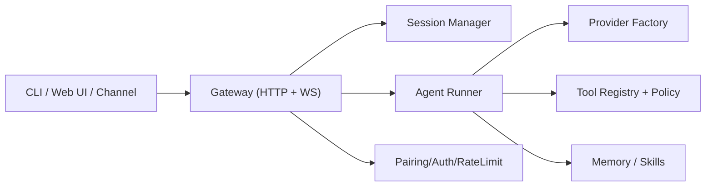

<p align="center">
  
</p>

<h1 align="center">HighClaw 🦀</h1>

<p align="center">
  <strong>ZeroClaw 架构思路 + Go 工程化实现的个人 AI 网关</strong><br/>
  单二进制、可自托管、多模型、多渠道、面向低层后端场景。
</p>

<p align="center">
  
</p>

---

## 为什么是 HighClaw

HighClaw 不是简单的“换语言重写”。
它的目标是把 OpenClaw 的使用体验，迁移到更适合后端与系统工程的 Go 运行时：

- 更直接的部署方式：单二进制分发，依赖面更可控
- 更稳定的服务模型：Gateway + Session + Policy 的控制面清晰
- 更偏后端的扩展方式：按 domain/application/infrastructure 分层扩展
- 更安全的默认行为：配对认证、令牌校验、限流、幂等、防误执行策略

> 设计参考了 ZeroClaw 的“低开销 + 强约束 + 可扩展”思路，并结合当前 Go 代码工程落地。

---

## 关键优势（当前版本）

### 1) 后端友好的架构分层（DDD）

- `internal/domain`：模型、渠道、技能等核心领域对象
- `internal/application`：技能管理、渠道编排等用例层
- `internal/interfaces`：HTTP / WebSocket / CLI
- `internal/infrastructure`：各渠道实现与外部适配
- `internal/agent`：Agent 运行时、工具循环、provider 工厂

这种分层让你后续做 HighClaw 企业化改造时，更容易控制边界和演进风险。

### 2) 安全默认策略已经内建

- Gateway 配对与 Bearer 鉴权
- API 限流与配对限流
- `X-Idempotency-Key` 幂等处理
- WebSocket 鉴权校验
- Bash 命令策略校验（allowlist + 危险模式拦截）

### 3) 多模型与提供商能力完整保留

- 支持 Anthropic / OpenAI / Google / Bedrock / Ollama / Groq 等多提供商模型目录
- 模型扫描、默认模型设置、Provider 元信息可直接用于 CLI / API

### 4) 统一控制面（CLI + HTTP + WebSocket）

- CLI 覆盖配置、会话、模型、技能、日志、内存、daemon 等运维场景
- HTTP API 提供状态、会话、模型、技能与运行时统计
- WebSocket 用于实时事件和会话交互

---

## 架构总览



### 模块关系（目录级）

```text
highclaw/
├── cmd/highclaw/                 # 程序入口
├── internal/
│   ├── agent/                    # Agent 运行时、provider、tools
│   ├── application/              # 用例层（skill/channel manager）
│   ├── domain/                   # 领域模型（model/skill/channel）
│   ├── gateway/                  # 网关协议与会话
│   ├── interfaces/               # HTTP / WS / CLI
│   ├── infrastructure/channels/  # Telegram/Discord/Slack/WhatsApp 适配
│   └── security/                 # pairing / rate-limit
├── pkg/pluginsdk/
└── skills/
```

---

## 快速开始

### 1. 构建

```bash
cd highclaw
make build
```

可执行文件默认输出到 `dist/highclaw`。

### 2. 初始化配置

```bash
./dist/highclaw onboard
```

### 3. 启动网关

```bash
./dist/highclaw gateway
```

默认地址（配置默认值）：

- `http://127.0.0.1:18790`
- 健康检查：`/api/health`
- 状态接口：`/api/status`

### 4. 发送一条消息

```bash
./dist/highclaw message "你好，HighClaw"
```

### 5. 常用运维命令

```bash
./dist/highclaw status
./dist/highclaw doctor
./dist/highclaw models list --all
./dist/highclaw sessions list
./dist/highclaw logs tail -n 200
```

---

## 安全与运行策略

### 鉴权与配对

- 当 `gateway.auth.mode != "none"` 时，API/WS 受 token 保护
- 支持一次性 pairing code 兑换 bearer token
- 配对失败触发限流与冷却

### 工具执行策略

- `bash` 执行受策略层约束
- 可通过配置维护 allow/deny
- 阻断常见危险命令模式（重定向、子命令注入等）

### 幂等与抗抖动

- Chat API 支持 `X-Idempotency-Key`
- 可避免重试场景下重复执行

---

## 当前能力边界（务实说明）

HighClaw 当前已具备完整控制面和主要后端能力，但仍处于持续完善阶段：

- 渠道适配层已可运行为“安全降级模式”，部分平台深度能力仍在持续增强
- Web UI 已可使用，视觉与交互仍在迭代
- 更完整的端到端集成测试仍建议在可访问 Go 依赖代理的网络环境下执行

---

## 与 ZeroClaw / OpenClaw 的关系

- **ZeroClaw**：提供了低开销、强策略、模块化设计的架构启发
- **OpenClaw**：提供了成熟的产品交互与多渠道实践参考
- **HighClaw**：在 Go 生态中重建上述能力，面向后端可维护性与可部署性

---

## 文档索引

- [GETTING_STARTED.md](GETTING_STARTED.md)
- [ARCHITECTURE.md](ARCHITECTURE.md)
- [FEATURES.md](FEATURES.md)
- [IMPLEMENTATION_STATUS.md](IMPLEMENTATION_STATUS.md)
- [FINAL_SUMMARY.md](FINAL_SUMMARY.md)

---

## License

MIT
