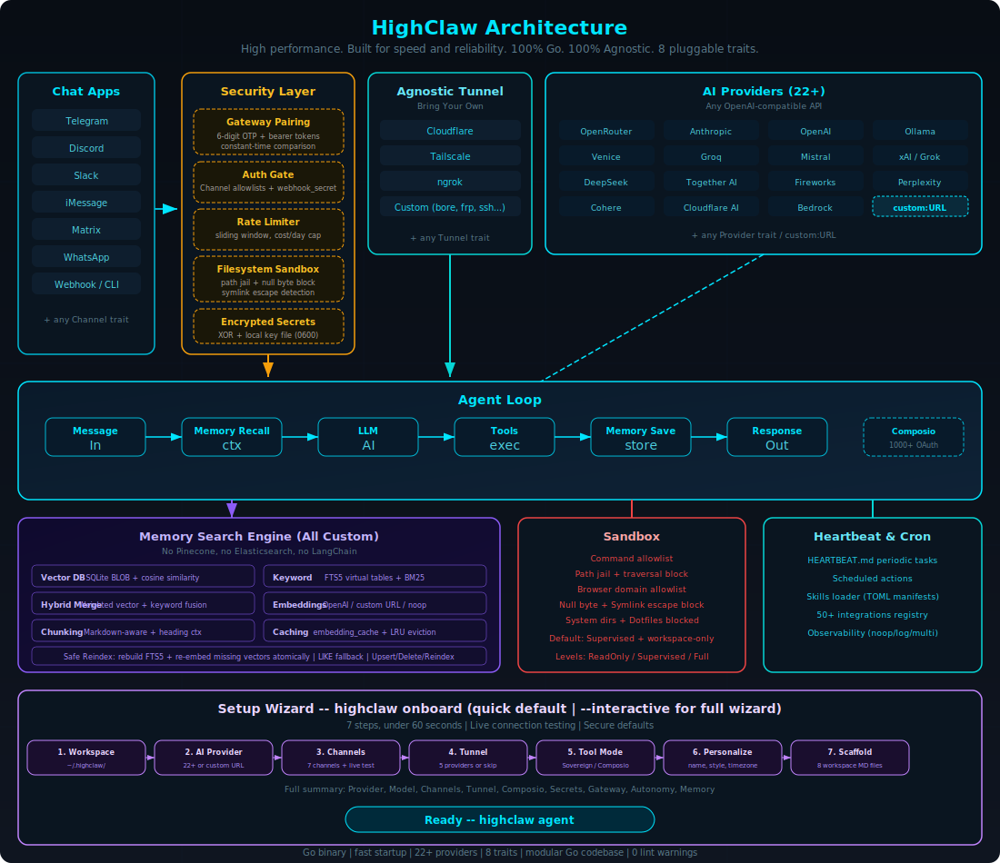

<p align="center">
  
</p>

<h1 align="center">HighClaw </h1>

<p align="center">
  <a href="./README.zh.md"></a>
  &nbsp;
  <a href="./README.md"></a>
</p>

<p align="center">
  <strong>High performance. Built for speed and reliability. 100% Go. 100% Agnostic.</strong><br>
  ⚡️ <strong>HighClaw keeps full feature coverage with an independent Go implementation.</strong>
</p>

<p align="center">
  <a href="LICENSE"></a>
  <a href="https://buymeacoffee.com/nx36683g"></a>
</p>

Fast, small, and fully autonomous AI assistant infrastructure — deploy anywhere, swap anything.

```
Go binary · modular traits · 22+ providers · pluggable channels/tools/memory · production-ready gateway
```

### ✨ Features

- 🏎️ **High Performance:** Optimized Go runtime with low-overhead startup and stable long-running execution.
- 💰 **Low Deployment Cost:** Single binary deployment for edge devices, VMs, and cloud hosts.
- 🚀 **Deployment Efficiency Advantage:** No Node/Python runtime bootstrap required; install + start in minutes.
- ⚡ **Operationally Reliable:** Strong defaults for gateway auth, memory persistence, and channel safety.
- 🌍 **True Portability:** Cross-platform binaries for macOS, Linux, and Windows (amd64/arm64).

### Why teams pick HighClaw

- **Lean by default:** small Go binary, fast startup, low memory footprint.
- **Secure by design:** pairing, strict sandboxing, explicit allowlists, workspace scoping.
- **Fully swappable:** core systems are traits (providers, channels, tools, memory, tunnels).
- **No lock-in:** OpenAI-compatible provider support + pluggable custom endpoints.

## HighClaw vs OpenClaw

### 1) 项目定位与目标

| 维度 | HighClaw | OpenClaw |
|---|---|---|
| 核心定位 | 高性能、可自托管、单二进制优先的 AI 助手基础设施（Go 实现） | 功能完整、生态丰富的个人 AI 助手平台（Node/TS 生态） |
| 目标 | 在保持功能覆盖的前提下，强化稳定性、部署效率与默认安全策略 | 提供更全面的交互体验与广泛生态集成能力 |
| 典型使用场景 | 后端服务、边缘设备、低资源主机、长时守护进程 | 本地桌面体验、前端生态联动、Node 生态深度集成 |

你可以把 HighClaw 理解为：面向工程化落地的 Go 版本 Claw Runtime，强调“可部署、可运维、可扩展”。

### 2) 技术栈与工程形态

| 维度 | HighClaw | OpenClaw |
|---|---|---|
| 主要语言 | Go | TypeScript (Node.js) |
| 运行时 | 原生二进制 | Node.js 运行时 |
| 可执行形态 | 单二进制 + 配置文件（`config.yaml`） | Node 运行时 + JS/TS 产物 |
| 依赖模型 | Go module + 系统最小依赖 | npm 生态依赖较多 |
| 部署方式 | `make build` / `make release` 一键多平台产物 | 通常依赖 Node 环境与包管理流程 |

### 3) 资源效率与运维体验

| 指标 | HighClaw | OpenClaw |
|---|---|---|
| 部署复杂度 | 低（单文件优先） | 中（需 Node 与依赖） |
| 多平台分发 | 内置 `make release`（linux/darwin/windows, amd64/arm64） | 依赖 Node 生态与打包链路 |
| 默认安全策略 | 配对认证、限流、工作区作用域、命令白名单 | 可实现同等级安全，但默认策略与工程实现路径不同 |
| 运维侧可控性 | 更偏后端可观测与守护进程管理 | 更偏应用层功能完整性 |

### HighClaw 的核心定位（结论）

- HighClaw 不是 OpenClaw 的“删减版”，而是 **Go 工程化实现**。
- 在 Claw 体系中，HighClaw 主打：**高性能部署、后端稳定性、低资源可运行、强安全默认值**。
- 如果你偏好“可交付与可运维”的 AI 助手基础设施，HighClaw 是更合适的技术路线。

## Quick Start

```bash
git clone https://github.com/903174293/highclaw.git
cd highclaw
make build
make install

# Quick setup (no prompts)
highclaw onboard --api-key sk-... --provider openrouter

# Or interactive wizard
highclaw onboard --interactive

# Or quickly repair channels/allowlists only
highclaw onboard --channels-only

# Chat
highclaw agent -m "Hello, HighClaw!"

# Interactive mode
highclaw agent

# Start the gateway (webhook server)
highclaw gateway                # default: 127.0.0.1:8080
highclaw gateway --port 0       # random port (security hardened)

# Start full autonomous runtime
highclaw daemon

# Check status
highclaw status

# Run system diagnostics
highclaw doctor

# Check channel health
highclaw channel doctor

# Get integration setup details
highclaw integrations info Telegram

# Manage background service
highclaw service install
highclaw service status

# Migrate memory from OpenClaw (safe preview first)
highclaw migrate openclaw --dry-run
highclaw migrate openclaw
```

> **Dev fallback (no global install):** prefix commands with `go run ./cmd/highclaw --` (example: `go run ./cmd/highclaw -- status`).

## 会话联动：`agent -m` + `tui`

HighClaw 统一使用 `~/.highclaw/sessions`：

- 每次执行 `highclaw agent -m "..."` 都会落盘为一个新会话。
- 也可以把消息追加到指定会话：`highclaw agent -m "..." --session <key>`。
- `highclaw tui` 左侧栏会展示这些会话。
- TUI 支持会话切换并继续上下文对话。
- 左侧栏按来源分组展示：**CLI / TUI / OTHER**。
- 会话栏支持实时过滤：切到会话栏后直接输入关键字即可。

### 会话管理命令

```bash
highclaw sessions list
highclaw sessions get <key>
highclaw sessions current
highclaw sessions switch <key>
highclaw sessions reset <key>
highclaw sessions delete <key>
highclaw sessions bindings
highclaw sessions bind <channel> <conversation> <sessionKey>
highclaw sessions unbind <channel> <conversation>
```

### 外接终端默认会话策略

- 不支持手动切换会话的终端/渠道（如 WhatsApp/Telegram/webhook/websocket）默认使用：
  - `agent:main:main`
- 如需按会话隔离，可绑定到指定会话：
  - `sessions bind <channel> <conversation> <sessionKey>`
- CLI/TUI 继续保留手动切换会话能力。

### TUI 常用按键

- `Tab`: 输入框/会话栏切换焦点
- `↑` / `↓`: 选择会话
- `Enter`: 发送消息（输入焦点）或打开会话（会话栏焦点）
- `Ctrl+N`: 新建会话
- `Ctrl+R`: 刷新会话列表
- `Ctrl+C`: 退出

### 快速验证

```bash
highclaw agent -m "第一条消息"
highclaw agent -m "第二条消息"
highclaw tui
```

## 部署方案（Windows / Ubuntu / CentOS / macOS）

### macOS

```bash
git clone https://github.com/903174293/highclaw.git
cd highclaw
make build
./dist/highclaw onboard
./dist/highclaw gateway
```

### Ubuntu

```bash
sudo apt-get update
sudo apt-get install -y make golang-go
git clone https://github.com/903174293/highclaw.git
cd highclaw
make build
sudo make install
highclaw onboard
highclaw daemon
```

### CentOS / RHEL / Rocky

```bash
sudo yum install -y make golang git
git clone https://github.com/903174293/highclaw.git
cd highclaw
make build
sudo make install
highclaw onboard
highclaw daemon
```

### Windows（PowerShell）

```powershell
git clone https://github.com/903174293/highclaw.git
cd highclaw
go build -o dist/highclaw.exe ./cmd/highclaw
.\dist\highclaw.exe onboard
.\dist\highclaw.exe gateway
```

### 部署效率优势（产品定位补充）

- 单二进制交付，减少环境依赖和部署漂移。
- 冷启动快、资源占用低，适合边缘节点和高密度部署。
- 多平台命令一致，降低团队维护成本。

## Architecture

Every subsystem is a **trait** — swap implementations with a config change, zero code changes.

<p align="center">
  
</p>

| Subsystem | Trait | Ships with | Extend |
|-----------|-------|------------|--------|
| **AI Models** | `Provider` | 22+ providers (OpenRouter, Anthropic, OpenAI, Ollama, Venice, Groq, Mistral, xAI, DeepSeek, Together, Fireworks, Perplexity, Cohere, Bedrock, etc.) | `custom:https://your-api.com` — any OpenAI-compatible API |
| **Channels** | `Channel` | CLI, Telegram, Discord, Slack, iMessage, Matrix, WhatsApp, Webhook | Any messaging API |
| **Memory** | `Memory` | SQLite with hybrid search (FTS5 + vector cosine similarity), Markdown | Any persistence backend |
| **Tools** | `Tool` | shell, file_read, file_write, memory_store, memory_recall, memory_forget, browser_open (Brave + allowlist), composio (optional) | Any capability |
| **Observability** | `Observer` | Noop, Log, Multi | Prometheus, OTel |
| **Runtime** | `RuntimeAdapter` | Native, Docker (sandboxed) | WASM (planned; unsupported kinds fail fast) |
| **Security** | `SecurityPolicy` | Gateway pairing, sandbox, allowlists, rate limits, filesystem scoping, encrypted secrets | — |
| **Identity** | `IdentityConfig` | OpenClaw (markdown), AIEOS v1.1 (JSON) | Any identity format |
| **Tunnel** | `Tunnel` | None, Cloudflare, Tailscale, ngrok, Custom | Any tunnel binary |
| **Heartbeat** | Engine | HEARTBEAT.md periodic tasks | — |
| **Skills** | Loader | TOML manifests + SKILL.md instructions | Community skill packs |
| **Integrations** | Registry | 50+ integrations across 9 categories | Plugin system |

### Runtime support (current)

- ✅ Supported today: `runtime.kind = "native"` or `runtime.kind = "docker"`
- 🚧 Planned, not implemented yet: WASM / edge runtimes

When an unsupported `runtime.kind` is configured, HighClaw now exits with a clear error instead of silently falling back to native.

### Memory System (Full-Stack Search Engine)

All custom, zero external dependencies — no Pinecone, no Elasticsearch, no LangChain:

| Layer | Implementation |
|-------|---------------|
| **Vector DB** | Embeddings stored as BLOB in SQLite, cosine similarity search |
| **Keyword Search** | FTS5 virtual tables with BM25 scoring |
| **Hybrid Merge** | Custom weighted merge function (`vector.rs`) |
| **Embeddings** | `EmbeddingProvider` trait — OpenAI, custom URL, or noop |
| **Chunking** | Line-based markdown chunker with heading preservation |
| **Caching** | SQLite `embedding_cache` table with LRU eviction |
| **Safe Reindex** | Rebuild FTS5 + re-embed missing vectors atomically |

The agent automatically recalls, saves, and manages memory via tools.

```yaml
memory:
  backend: "sqlite" # "sqlite", "markdown", "none"
  auto_save: true
  embedding_provider: "openai"
  vector_weight: 0.7
  keyword_weight: 0.3
```

## Security

HighClaw enforces security at **every layer** — not just the sandbox. It passes all items from the community security checklist.

### Security Checklist

| # | Item | Status | How |
|---|------|--------|-----|
| 1 | **Gateway not publicly exposed** | ✅ | Binds `127.0.0.1` by default. Refuses `0.0.0.0` without tunnel or explicit `allow_public_bind = true`. |
| 2 | **Pairing required** | ✅ | 6-digit one-time code on startup. Exchange via `POST /pair` for bearer token. All `/webhook` requests require `Authorization: Bearer <token>`. |
| 3 | **Filesystem scoped (no /)** | ✅ | `workspace_only = true` by default. 14 system dirs + 4 sensitive dotfiles blocked. Null byte injection blocked. Symlink escape detection via canonicalization + resolved-path workspace checks in file read/write tools. |
| 4 | **Access via tunnel only** | ✅ | Gateway refuses public bind without active tunnel. Supports Tailscale, Cloudflare, ngrok, or any custom tunnel. |

> **Run your own nmap:** `nmap -p 1-65535 <your-host>` — HighClaw binds to localhost only, so nothing is exposed unless you explicitly configure a tunnel.

### Channel allowlists (Telegram / Discord / Slack)

Inbound sender policy is now consistent:

- Empty allowlist = **deny all inbound messages**
- `"*"` = **allow all** (explicit opt-in)
- Otherwise = exact-match allowlist

This keeps accidental exposure low by default.

Recommended low-friction setup (secure + fast):

- **Telegram:** allowlist your own `@username` (without `@`) and/or your numeric Telegram user ID.
- **Discord:** allowlist your own Discord user ID.
- **Slack:** allowlist your own Slack member ID (usually starts with `U`).
- Use `"*"` only for temporary open testing.

If you're not sure which identity to use:

1. Start channels and send one message to your bot.
2. Read the warning log to see the exact sender identity.
3. Add that value to the allowlist and rerun channels-only setup.

If you hit authorization warnings in logs (for example: `ignoring message from unauthorized user`),
rerun channel setup only:

```bash
highclaw onboard --channels-only
```

### WhatsApp Business Cloud API Setup

WhatsApp uses Meta's Cloud API with webhooks (push-based, not polling):

1. **Create a Meta Business App:**
   - Go to [developers.facebook.com](https://developers.facebook.com)
   - Create a new app → Select "Business" type
   - Add the "WhatsApp" product

2. **Get your credentials:**
   - **Access Token:** From WhatsApp → API Setup → Generate token (or create a System User for permanent tokens)
   - **Phone Number ID:** From WhatsApp → API Setup → Phone number ID
   - **Verify Token:** You define this (any random string) — Meta will send it back during webhook verification

3. **Configure HighClaw:**
   ```yaml
   channels_config:
     whatsapp:
       access_token: "EAABx..."
       phone_number_id: "123456789012345"
       verify_token: "my-secret-verify-token"
       allowed_numbers:
         - "+1234567890" # E.164 format, or ["*"] for all
   ```

4. **Start the gateway with a tunnel:**
   ```bash
   highclaw gateway --port 8080
   ```
   WhatsApp requires HTTPS, so use a tunnel (ngrok, Cloudflare, Tailscale Funnel).

5. **Configure Meta webhook:**
   - In Meta Developer Console → WhatsApp → Configuration → Webhook
   - **Callback URL:** `https://your-tunnel-url/whatsapp`
   - **Verify Token:** Same as your `verify_token` in config
   - Subscribe to `messages` field

6. **Test:** Send a message to your WhatsApp Business number — HighClaw will respond via the LLM.

## Configuration

Config: `~/.highclaw/config.yaml` (created by `onboard`)

```yaml
api_key: "sk-..."
default_provider: "openrouter"
default_model: "anthropic/claude-sonnet-4"
default_temperature: 0.7

memory:
  backend: "sqlite" # "sqlite", "markdown", "none"
  auto_save: true
  embedding_provider: "openai" # "openai", "noop"
  vector_weight: 0.7
  keyword_weight: 0.3

gateway:
  require_pairing: true
  allow_public_bind: false

autonomy:
  level: "supervised" # "readonly", "supervised", "full"
  workspace_only: true
  allowed_commands: ["git", "go", "make", "ls", "cat", "grep"]
  forbidden_paths: ["/etc", "/root", "/proc", "/sys", "~/.ssh", "~/.gnupg", "~/.aws"]

runtime:
  kind: "native" # "native" or "docker"
  docker:
    image: "alpine:3.20"
    network: "none"
    memory_limit_mb: 512
    cpu_limit: 1.0
    read_only_rootfs: true
    mount_workspace: true
    allowed_workspace_roots: []

heartbeat:
  enabled: false
  interval_minutes: 30

tunnel:
  provider: "none" # "none", "cloudflare", "tailscale", "ngrok", "custom"

secrets:
  encrypt: true

browser:
  enabled: false
  allowed_domains: ["docs.rs"]

composio:
  enabled: false

identity:
  format: "openclaw" # "openclaw" or "aieos"
# aieos_path: "identity.json"
# aieos_inline: '{"identity":{"names":{"first":"Nova"}}}'
```

## Identity System (AIEOS Support)

HighClaw supports **identity-agnostic** AI personas through two formats:

### OpenClaw (Default)

Traditional markdown files in your workspace:
- `IDENTITY.md` — Who the agent is
- `SOUL.md` — Core personality and values
- `USER.md` — Who the agent is helping
- `AGENTS.md` — Behavior guidelines

### AIEOS (AI Entity Object Specification)

[AIEOS](https://aieos.org) is a standardization framework for portable AI identity. HighClaw supports AIEOS v1.1 JSON payloads, allowing you to:

- **Import identities** from the AIEOS ecosystem
- **Export identities** to other AIEOS-compatible systems
- **Maintain behavioral integrity** across different AI models

#### Enable AIEOS

```yaml
identity:
  format: "aieos"
  aieos_path: "identity.json" # relative to workspace or absolute path
```

Or inline JSON:

```yaml
identity:
  format: "aieos"
  aieos_inline: |
{
  "identity": {
    "names": { "first": "Nova", "nickname": "N" }
  },
  "psychology": {
    "neural_matrix": { "creativity": 0.9, "logic": 0.8 },
    "traits": { "mbti": "ENTP" },
    "moral_compass": { "alignment": "Chaotic Good" }
  },
  "linguistics": {
    "text_style": { "formality_level": 0.2, "slang_usage": true }
  },
  "motivations": {
    "core_drive": "Push boundaries and explore possibilities"
  }
}
```

#### AIEOS Schema Sections

| Section | Description |
|---------|-------------|
| `identity` | Names, bio, origin, residence |
| `psychology` | Neural matrix (cognitive weights), MBTI, OCEAN, moral compass |
| `linguistics` | Text style, formality, catchphrases, forbidden words |
| `motivations` | Core drive, short/long-term goals, fears |
| `capabilities` | Skills and tools the agent can access |
| `physicality` | Visual descriptors for image generation |
| `interests` | Hobbies, favorites, lifestyle |

See [aieos.org](https://aieos.org) for the full schema and live examples.

## Gateway API

| Endpoint | Method | Auth | Description |
|----------|--------|------|-------------|
| `/health` | GET | None | Health check (always public, no secrets leaked) |
| `/pair` | POST | `X-Pairing-Code` header | Exchange one-time code for bearer token |
| `/webhook` | POST | `Authorization: Bearer <token>` | Send message: `{"message": "your prompt"}` |
| `/whatsapp` | GET | Query params | Meta webhook verification (hub.mode, hub.verify_token, hub.challenge) |
| `/whatsapp` | POST | None (Meta signature) | WhatsApp incoming message webhook |

## Commands

| Command | Description |
|---------|-------------|
| `onboard` | Quick setup (default) |
| `onboard --interactive` | Full interactive 8-step wizard |
| `onboard --channels-only` | Reconfigure channels/allowlists only (fast repair flow) |
| `agent -m "..."` | Single message mode |
| `agent -m "..." --session <key>` | 追加到指定会话 |
| `agent` | Interactive chat mode |
| `sessions list/get/current/switch/reset/delete` | 会话查询、切换与清理 |
| `sessions bindings/bind/unbind` | 外部会话路由绑定 |
| `gateway` | Start webhook server (default: `127.0.0.1:8080`) |
| `gateway --port 0` | Random port mode |
| `daemon` | Start long-running autonomous runtime |
| `service install/start/stop/status/uninstall` | Manage user-level background service |
| `doctor` | Diagnose daemon/scheduler/channel freshness |
| `status` | Show full system status |
| `channel doctor` | Run health checks for configured channels |
| `integrations info <name>` | Show setup/status details for one integration |

## Development

```bash
make build-dev           # Dev build
make build               # Release build
make test                # Run tests
make lint                # Lint (golangci-lint)
make fmt                 # Format

# Cross-platform build artifacts
make release
```

## Makefile Usage Guide

HighClaw 提供完整的 Makefile 自动化工具，覆盖开发、测试、打包、安装、发布。

### 常用命令

```bash
make help          # 查看全部命令
make build         # 本机构建 dist/highclaw
make build-dev     # 开发构建 dist/highclaw-dev
make test          # 运行测试（race）
make check         # vet + test
make clean         # 清理产物
```

### 多平台构建与发布

```bash
make build-all     # 构建 linux/darwin/windows + amd64/arm64
make package       # 生成 tar.gz / zip 包（输出到 dist/release）
make release       # 等价于 build-all + package
```

默认产物示例：

- `dist/highclaw-linux-amd64`
- `dist/highclaw-darwin-arm64`
- `dist/highclaw-windows-amd64.exe`
- `dist/release/highclaw-<version>-<os>-<arch>.tar.gz|zip`

### 安装与卸载

```bash
make install       # 安装到 GOBIN / GOPATH/bin / ~/go/bin
make uninstall     # 卸载 highclaw
```

安装路径优先级：

1. `GOBIN`
2. `GOPATH/bin`
3. `~/go/bin`

### 代码质量与诊断

```bash
make fmt           # gofmt 格式化
make vet           # go vet 静态检查
make lint          # golangci-lint（需预先安装）
make doctor        # 打印版本、Go 环境、主机平台、安装路径
```

### Pre-push hook

A git hook runs `gofmt`, `go vet`, and `go test` before every push. Enable it once:

```bash
git config core.hooksPath .githooks
```

To skip the hook when you need a quick push during development:

```bash
git push --no-verify
```

## Support

HighClaw is an open-source project maintained with passion. If you find it useful and would like to support its continued development, hardware for testing, and coffee for the maintainer, you can support me here:

<a href="https://buymeacoffee.com/nx36683g"></a>

## License

MIT — see [LICENSE](LICENSE)
- IP policy — see [INTELLECTUAL_PROPERTY.md](INTELLECTUAL_PROPERTY.md)
- Trademark policy — see [TRADEMARKS.md](TRADEMARKS.md)

## Contributing

See [CONTRIBUTING.md](CONTRIBUTING.md). Implement a trait, submit a PR:
- Individual CLA (required) — see [CLA-INDIVIDUAL.md](CLA-INDIVIDUAL.md)
- Security reporting — see [SECURITY.md](SECURITY.md)
- CI workflow guide: [docs/ci-map.md](docs/ci-map.md)
- New `Provider` → `src/providers/`
- New `Channel` → `src/channels/`
- New `Observer` → `src/observability/`
- New `Tool` → `src/tools/`
- New `Memory` → `src/memory/`
- New `Tunnel` → `src/tunnel/`
- New `Skill` → `~/.highclaw/workspace/skills/<name>/`

---

**HighClaw** — High performance. Built for speed and reliability. Deploy anywhere. Swap anything. 
